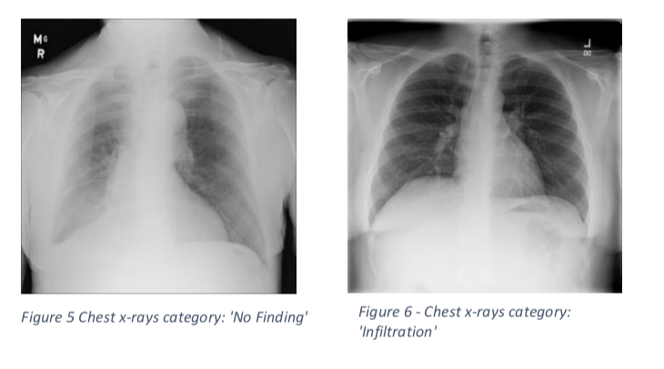

# 🧠 Classifying Medical Diagnosis:
### A Convolutional Neural Network Predicting Clinical Diagnosis in Chest X-Rays

Developed in 2019. 
A dataset sample of National Institutes of Health Chest X-Ray data was used to test the performance of a CNN model in an image classification task

 
The sample dataset contains 5606 X- Ray images and 244 class labels. The dataset was down sampled to just 3547 X-Ray images with 2 class labels being ‘No Finding’ and ‘Infiltration’. The data was split into training and test datasets, again with 80% of the data in the training set and 20% in the test set.

### ✉️ Contact
For further information feel free to connect with one of the authors Matilde Nesheim on [matildenesheim@hotmail.com](mailto:matildenesheim@hotmail.com?subject=[GitHub]%20clinical-diagnosis-cnn) or on LinkedIn:

[][linkedin]

 

[linkedin]: https://www.linkedin.com/in/matildenesheim
